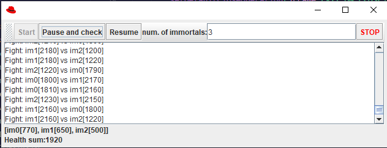

## Escuela Colombiana de Ingeniería
### Arquitecturas de Software – ARSW

## ESTUDIANTES: NICOLAS CASTRO JARAMILLO Y SEGIO ANDRES GONZALES

#### Ejercicio – programación concurrente, condiciones de carrera y sincronización de hilos. EJERCICIO INDIVIDUAL O EN PAREJAS.

##### Parte I – Antes de terminar la clase.

Control de hilos con wait/notify. Productor/consumidor.

1. Revise el funcionamiento del programa y ejecútelo. Mientras esto ocurren, ejecute jVisualVM y revise el consumo de CPU del proceso correspondiente. A qué se debe este consumo?, cual es la clase responsable?


*Podemos ver que el consumo de CPU ronda entre el 30-35%*

*La clase responsable de esto es Consumer.*

*El consumo se debe en parte a que se intenta consumir de la cola cuando esta vacía, la clase Consumer está esperando que la clase Producer agregue algo a la cola, está constantemente intentando consumir elementos de la cola incluso si el Producer no los está produciendo.*


2. Haga los ajustes necesarios para que la solución use más eficientemente la CPU, teniendo en cuenta que -por ahora- la producción es lenta y el consumo es rápido. Verifique con JVisualVM que el consumo de CPU se reduzca.

*Al solucionarlo podemos preciar una disminucion en el consumo de la CPU como se muestra en la siguiente imagen:*


*La solucion que encontramos fue usar synchronized con su llave queue, ya que este es usado tanto por Consumer como por Producer, utilizando sincronización logramos evitar el consumo excesivo de CPU cuando la cola está vacía y solo consumira elementos cuando la cola tenga algun elemento*


3. Haga que ahora el productor produzca muy rápido, y el consumidor consuma lento. Teniendo en cuenta que el productor conoce un límite de Stock (cuantos elementos debería tener, a lo sumo en la cola), haga que dicho límite se respete. Revise el API de la colección usada como cola para ver cómo garantizar que dicho límite no se supere. Verifique que, al poner un límite pequeño para el 'stock', no haya consumo alto de CPU ni errores.

```
package edu.eci.arst.concprg.prodcons;

import java.util.Queue;

/**
 *
 * @author hcadavid
 */
public class Consumer extends Thread{
    
    private Queue<Integer> queue;
    
    
    public Consumer(Queue<Integer> queue){
        this.queue=queue;        
    }
    
    @Override
    public void run() {
        while (true) {
                try {
                    Thread.sleep(5000);
                } catch (InterruptedException e) {
                    e.printStackTrace();
                }

            synchronized(queue){                
                if (queue.size() > 0) { 
                    int elem=queue.poll();
                    System.out.println("Consumer consumes "+elem);                                
                }
            }
        }
    }
}
```

*Aqui el consumidor consume muy lento ya que su periodo de espera para consumir es de 5 segundos*


```
package edu.eci.arst.concprg.prodcons;

import java.util.Queue;
import java.util.Random;
import java.util.logging.Level;
import java.util.logging.Logger;

/**
 *
 * @author hcadavid
 */
public class Producer extends Thread {

    private Queue<Integer> queue = null;

    private int dataSeed = 0;
    private Random rand=null;
    private final long stockLimit;

    public Producer(Queue<Integer> queue,long stockLimit) {
        this.queue = queue;
        rand = new Random(System.currentTimeMillis());
        this.stockLimit=stockLimit;
    }

    @Override
    public void run() {
        while (true) {
            if(queue.size()<stockLimit){
                dataSeed = dataSeed + rand.nextInt(100);
                System.out.println("Producer added " + dataSeed);
                queue.add(dataSeed);
            }
            try {
                Thread.sleep(1000);
            } catch (InterruptedException ex) {
                Logger.getLogger(Producer.class.getName()).log(Level.SEVERE, null, ex);
            }

        }
    }
}

```
*Aqui el producer produce relativamente rapido ya que tiene un tiempo de espera de solo 1 segundo entre cada produccion, Al establecer un límite pequeño para el stock, como stockLimit = 5, no deberia haber un alto consumo de CPU y que se respetará el límite de existencias en la cola y que no genere errores.*


##### Parte II. – Avance para el jueves, antes de clase.

Sincronización y Dead-Locks.


1. Revise el programa “highlander-simulator”, dispuesto en el paquete edu.eci.arsw.highlandersim. Este es un juego en el que:

	* Se tienen N jugadores inmortales.
	* Cada jugador conoce a los N-1 jugador restantes.
	* Cada jugador, permanentemente, ataca a algún otro inmortal. El que primero ataca le resta M puntos de vida a su contrincante, y aumenta en esta misma cantidad sus propios puntos de vida.
	* El juego podría nunca tener un único ganador. Lo más probable es que al final sólo queden dos, peleando indefinidamente quitando y sumando puntos de vida.

2. Revise el código e identifique cómo se implemento la funcionalidad antes indicada. Dada la intención del juego, un invariante debería ser que la sumatoria de los puntos de vida de todos los jugadores siempre sea el mismo(claro está, en un instante de tiempo en el que no esté en proceso una operación de incremento/reducción de tiempo). Para este caso, para N jugadores, cual debería ser este valor?.

*El invariante del juego debe ser la sumatoria de los puntos de vida de todos los jugadores , la cual debe ser constante, por lo que el valor total de puntos de vida debería ser igual a N multiplicado por la cantidad inicial de puntos de vida de cada jugador.*

*La invariante es N x DEFAULT_IMMORTAL_HEALTH.*

3. Ejecute la aplicación y verifique cómo funcionan las opción ‘pause and check’. Se cumple el invariante?.

*No lo cumple. Ya que como la vida default es 100 y los inmortales son 3 en este caso la invariante seria 3 x 100*



4. Una primera hipótesis para que se presente la condición de carrera para dicha función (pause and check), es que el programa consulta la lista cuyos valores va a imprimir, a la vez que otros hilos modifican sus valores. Para corregir esto, haga lo que sea necesario para que efectivamente, antes de imprimir los resultados actuales, se pausen todos los demás hilos. Adicionalmente, implemente la opción ‘resume’.

*Funcion Pause and Check y Resume implementadas*


*Modificamos la clase immortal para controlar la pausa y reanudacion de los hilos*


5. Verifique nuevamente el funcionamiento (haga clic muchas veces en el botón). Se cumple o no el invariante?.


*No, aun no se cumple el invariante*

6. Identifique posibles regiones críticas en lo que respecta a la pelea de los inmortales. Implemente una estrategia de bloqueo que evite las condiciones de carrera. Recuerde que si usted requiere usar dos o más ‘locks’ simultáneamente, puede usar bloques sincronizados anidados:

	```java
	synchronized(locka){
		synchronized(lockb){
			…
		}
	}
	```

*En el codigo identificamos dos regiones criticas que pueden causar condiciones de carreras, en el metodo run con el valor immortalPopulation y el metodo fight con el valor i2, utilizamos syncronized para proteger los bloques de codigo*
 


7. Tras implementar su estrategia, ponga a correr su programa, y ponga atención a si éste se llega a detener. Si es así, use los programas jps y jstack para identificar por qué el programa se detuvo.

*Al correr el programa podemos ver que la invariable si se cumple y despues de un largo rato corriendo el programa vemos que en ningun momento se detiene.*


8. Plantee una estrategia para corregir el problema antes identificado (puede revisar de nuevo las páginas 206 y 207 de _Java Concurrency in Practice_).

9. Una vez corregido el problema, rectifique que el programa siga funcionando de manera consistente cuando se ejecutan 100, 1000 o 10000 inmortales. Si en estos casos grandes se empieza a incumplir de nuevo el invariante, debe analizar lo realizado en el paso 4.


10. Un elemento molesto para la simulación es que en cierto punto de la misma hay pocos 'inmortales' vivos realizando peleas fallidas con 'inmortales' ya muertos. Es necesario ir suprimiendo los inmortales muertos de la simulación a medida que van muriendo. Para esto:
	* Analizando el esquema de funcionamiento de la simulación, esto podría crear una condición de carrera? Implemente la funcionalidad, ejecute la simulación y observe qué problema se presenta cuando hay muchos 'inmortales' en la misma. Escriba sus conclusiones al respecto en el archivo RESPUESTAS.txt.
	* Corrija el problema anterior __SIN hacer uso de sincronización__, pues volver secuencial el acceso a la lista compartida de inmortales haría extremadamente lenta la simulación.

*Separamos los inmortales de vivos y muertos en dos listas separadas, cuando tienen vida 0 los eliminamos de los inmortales vivos y los agregamos a los muertos y solo iteramos sobre la lista de inmortales vivos para evitar utilizar sincronizacion*


11. Para finalizar, implemente la opción STOP.


*Implementamos la funcion de STOP*


*Modificamos el metodo run de Immortal*


*Probamos la ejecucion*


<!--
### Criterios de evaluación

1. Parte I.
	* Funcional: La simulación de producción/consumidor se ejecuta eficientemente (sin esperas activas).

2. Parte II. (Retomando el laboratorio 1)
	* Se modificó el ejercicio anterior para que los hilos llevaran conjuntamente (compartido) el número de ocurrencias encontradas, y se finalizaran y retornaran el valor en cuanto dicho número de ocurrencias fuera el esperado.
	* Se garantiza que no se den condiciones de carrera modificando el acceso concurrente al valor compartido (número de ocurrencias).


2. Parte III.
	* Diseño:
		- Coordinación de hilos:
			* Para pausar la pelea, se debe lograr que el hilo principal induzca a los otros a que se suspendan a sí mismos. Se debe también tener en cuenta que sólo se debe mostrar la sumatoria de los puntos de vida cuando se asegure que todos los hilos han sido suspendidos.
			* Si para lo anterior se recorre a todo el conjunto de hilos para ver su estado, se evalúa como R, por ser muy ineficiente.
			* Si para lo anterior los hilos manipulan un contador concurrentemente, pero lo hacen sin tener en cuenta que el incremento de un contador no es una operación atómica -es decir, que puede causar una condición de carrera- , se evalúa como R. En este caso se debería sincronizar el acceso, o usar tipos atómicos como AtomicInteger).

		- Consistencia ante la concurrencia
			* Para garantizar la consistencia en la pelea entre dos inmortales, se debe sincronizar el acceso a cualquier otra pelea que involucre a uno, al otro, o a los dos simultáneamente:
			* En los bloques anidados de sincronización requeridos para lo anterior, se debe garantizar que si los mismos locks son usados en dos peleas simultánemante, éstos será usados en el mismo orden para evitar deadlocks.
			* En caso de sincronizar el acceso a la pelea con un LOCK común, se evaluará como M, pues esto hace secuencial todas las peleas.
			* La lista de inmortales debe reducirse en la medida que éstos mueran, pero esta operación debe realizarse SIN sincronización, sino haciendo uso de una colección concurrente (no bloqueante).

	

	* Funcionalidad:
		* Se cumple con el invariante al usar la aplicación con 10, 100 o 1000 hilos.
		* La aplicación puede reanudar y finalizar(stop) su ejecución.
		
		-->

<a rel="license" href="http://creativecommons.org/licenses/by-nc/4.0/"></a><br />Este contenido hace parte del curso Arquitecturas de Software del programa de Ingeniería de Sistemas de la Escuela Colombiana de Ingeniería, y está licenciado como <a rel="license" href="http://creativecommons.org/licenses/by-nc/4.0/">Creative Commons Attribution-NonCommercial 4.0 International License</a>.
